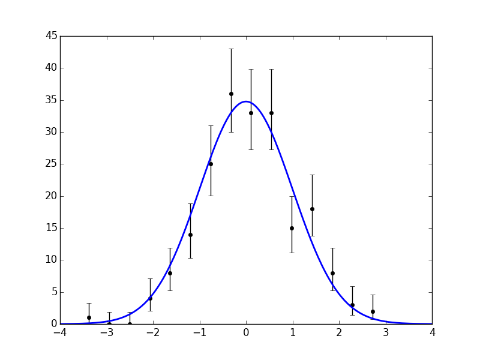
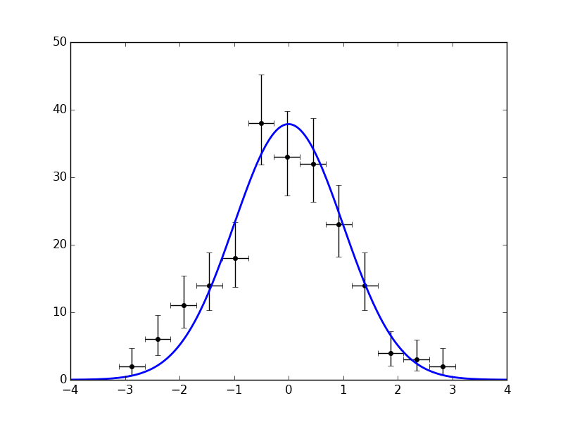

# matplotlib-hep

An add-on for matplotlib that simplifies the creation of plots for high energy physics.

## The histpoints plotting function

In high energy physics, histograms are often displayed as a collection of data points, one for each bin.
This allows one to easily compare the data to an underlying probability model.

It can be debated if it is correct to attach error bars to the individual bin contents as opposed to the underlying model,
as we want to know if our expectation for any given bin could fluctuate to match the data and not vice versa.
But this is a convention widely used by the HEP community, and thus a way to use this kind of plot in Python is often necessary.

A simple way to create these kinds of plots is missing from other Python packages like matplotlib.
The `histpoints` function is designed to produce these plots conventiently, like in the following example:

```python
from matplotlib_hep import histpoints
import matplotlib.pyplot as plt
import numpy as np
import scipy.stats as stats

data = np.random.normal(0, 1, 200)
x, y, norm = histpoints(data)

xs = np.linspace(-4, 4, 200)
plt.plot(xs, norm * stats.norm.pdf(xs, 0, 1), 'b-', lw=2)

plt.savefig('histpoints.png')
```



Or, displaying horizontal error bars to mark the bin width:
```python
histpoints(data, xerr='binwidth')
```



By default, the number of bins is chosen automatically via the Freedman-Diaconis rule.

